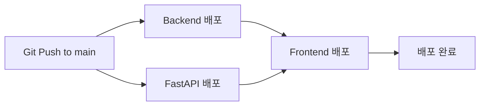

# CI/CD 설정 가이드

## 🎯 개요

이 프로젝트는 GitHub Actions를 사용하여 Google Cloud Run에 자동 배포됩니다.
`main` 브랜치에 push하면 자동으로 백엔드, FastAPI, 프론트엔드가 순차적으로 배포됩니다.

---

## 📋 사전 준비사항

### 1. Google Cloud Service Account 생성

```bash
# GCP Console에서 또는 gcloud 명령어로 생성
gcloud iam service-accounts create github-actions \
    --display-name="GitHub Actions"

# 필요한 권한 부여
gcloud projects add-iam-policy-binding dementia-care-project \
    --member="serviceAccount:github-actions@dementia-care-project.iam.gserviceaccount.com" \
    --role="roles/run.admin"

gcloud projects add-iam-policy-binding dementia-care-project \
    --member="serviceAccount:github-actions@dementia-care-project.iam.gserviceaccount.com" \
    --role="roles/storage.admin"

gcloud projects add-iam-policy-binding dementia-care-project \
    --member="serviceAccount:github-actions@dementia-care-project.iam.gserviceaccount.com" \
    --role="roles/iam.serviceAccountUser"

# Service Account 키 생성 (JSON)
gcloud iam service-accounts keys create key.json \
    --iam-account=github-actions@dementia-care-project.iam.gserviceaccount.com
```

---

## 🔐 GitHub Secrets 설정

GitHub Repository → Settings → Secrets and variables → Actions → New repository secret

다음 Secrets를 추가하세요:

| Secret 이름 | 설명 | 예시 |
|-------------|------|------|
| `GCP_SA_KEY` | Google Cloud Service Account 키 (JSON 전체 내용) | `{ "type": "service_account", ... }` |
| `DB_PASSWORD` | PostgreSQL 비밀번호 | `your_secure_password` |
| `TMAP_API_KEY` | TMAP API 키 | `your_tmap_api_key` |
| `GEMINI_API_KEY` | Google Gemini API 키 | `AIzaSy...` |
| `KAKAO_JS_KEY` | 카카오 지도 JavaScript API 키 | `52b0ab3f...` |

---

## 🚀 배포 프로세스

### 자동 배포 (main 브랜치 push 시)

```bash
# develop 브랜치에서 작업
git checkout develop
# 코드 수정...
git add .
git commit -m "feat: 새로운 기능 추가"
git push origin develop

# main 브랜치로 병합 (자동 배포 트리거)
git checkout main
git merge develop
git push origin main  # ✅ 이 시점에 CI/CD 자동 실행
```

### 수동 배포 (GitHub Actions UI)

1. GitHub Repository → Actions 탭
2. "Deploy to Cloud Run" 워크플로우 선택
3. "Run workflow" 버튼 클릭
4. "Run workflow" 확인

---

## 📊 배포 순서



1. **백엔드 배포** (병렬)
   - Spring Boot 애플리케이션
   - 환경변수: DB, TMAP, Gemini API 키
   
2. **FastAPI 배포** (병렬)
   - Python FastAPI 애플리케이션
   - 환경변수: Gemini API 키

3. **프론트엔드 배포** (백엔드/FastAPI 완료 후)
   - Vue.js 애플리케이션
   - 빌드 환경변수: 백엔드/FastAPI URL (동적 조회), Kakao API 키

---

## 🔧 환경변수 변경 시

### API 키 변경 (예: GEMINI_API_KEY)

```bash
# GitHub Secrets에서만 변경
1. GitHub Repository → Settings → Secrets
2. GEMINI_API_KEY 선택 → Update
3. 새 키 입력 → Update secret

# main 브랜치에 push하면 자동으로 새 키로 재배포됨
git push origin main
```

### 프로젝트 설정 변경 (PROJECT_ID, REGION 등)

`.github/workflows/deploy.yml` 파일의 `env` 섹션 수정:

```yaml
env:
  PROJECT_ID: dementia-care-project  # 여기 수정
  REGION: asia-northeast3            # 여기 수정
```

---

## 🐛 문제 해결

### 배포 실패 시

1. **GitHub Actions 로그 확인**
   ```
   GitHub Repository → Actions → 실패한 워크플로우 클릭 → 로그 확인
   ```

2. **Google Cloud Run 로그 확인**
   ```bash
   gcloud run services logs read SERVICE_NAME --region asia-northeast3 --limit 50
   ```

3. **일반적인 오류**
   - **권한 오류**: Service Account에 필요한 IAM 권한 확인
   - **빌드 오류**: Dockerfile 또는 코드 오류 확인
   - **환경변수 오류**: GitHub Secrets 값 확인

### 로컬에서 테스트

```bash
# 환경변수 설정 후 Docker 빌드
cd backend
docker build -t backend-test .
docker run -p 8080:8080 \
  -e DB_HOST=... \
  -e GEMINI_API_KEY=... \
  backend-test
```

---

## 📚 추가 리소스

- [GitHub Actions 문서](https://docs.github.com/en/actions)
- [Google Cloud Run 문서](https://cloud.google.com/run/docs)
- [로컬 개발 가이드](./README_LOCAL_SETUP.md)
- [환경변수 예시](./env-example.txt)

---

## ⚠️ 주의사항

1. **main 브랜치 보호**: main 브랜치는 직접 push하지 말고 PR 또는 develop에서 merge
2. **Secrets 관리**: API 키는 절대 코드에 포함하지 말 것
3. **비용 관리**: Cloud Run은 사용량에 따라 과금됨 (무료 할당량 확인)
4. **로그 모니터링**: 정기적으로 배포 로그와 애플리케이션 로그 확인

---

## 📞 문의

CI/CD 관련 문제가 있으면 팀 리더에게 문의하세요.

